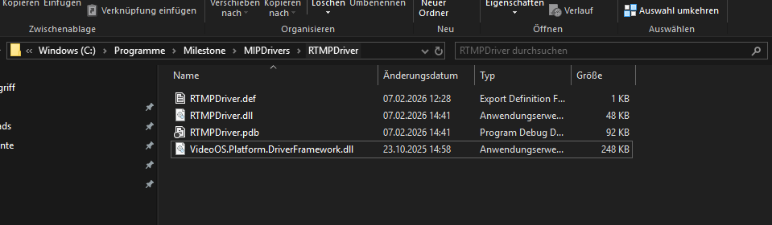

# RTMPDriver

A Milestone XProtect™ MIP device driver that receives direct RTMP push streams and passes H.264 video through to Milestone. Push from OBS, FFmpeg, Drones, or any RTMP-capable source directly into XProtect™ -- no intermediate media server required.

> [!IMPORTANT]
> This is an independent open source project and is **not affiliated with, endorsed by, or supported by Milestone Systems**. XProtect™ is a trademark of Milestone Systems A/S.

## Quick Start

1. Download the installer from [Releases](../../releases)
2. Add hardware in Management Client (see [Installation](#installation) for details)
3. Point your RTMP source at `rtmp://<milestone-server>:<port>/<stream-path>` (or `rtmps://` with [TLS enabled](#tls--rtmps))

**Requirements:** Milestone XProtect™ (Professional+, Expert, Corporate, or Essential+) with a Recording Server.

## Installation

### Installer (Recommended)

Download `MSCPlugins-vX.X-Setup.exe` from [Releases](../../releases) and run as **Administrator**. Select **RTMP Push Driver** in the component list.

### Manual (ZIP)

1. Download `RTMPDriver-vX.X.zip` from [Releases](../../releases)
2. **Unblock the ZIP before extracting** -- right-click the `.zip` -> Properties -> Unblock -> OK
3. Stop the **Milestone XProtect™ Recording Server** service
4. Create a `MIPDrivers` folder in `C:\Program Files\Milestone\` (if it doesn't already exist)
5. Extract into `C:\Program Files\Milestone\MIPDrivers\RTMPDriver\`



6. Start the **Milestone XProtect™ Recording Server** service

### Add New RTMP Device

After installing, add new hardware in the **Management Client**:

**Credentials:** Milestone requires a credential to connect, even though this driver does not verify them. Add any username/password combination (e.g. `root` / `pass` or just leave empty) and make sure it is checked.

**Factory Default:** If you use factory default as credentials, then you need to select manually the driver (Hardware Model) in the *Add Hardware* Tab.

> [!NOTE]
> **The port you enter (Add Hardware Tab) becomes the RTMP listening port** (e.g. `8783`). The wizard defaults to port 80, so you must change it to your desired RTMP port.
> To add **multiple instances**, use `localhost` with a different port for each one. Each instance needs a **unique port**.

> [!CAUTION]
> Each driver instance must use a unique port. If two instances share the same port, the second one will fail to add and shown as not responding.

## Usage

Push an RTMP stream to `rtmp://<milestone-server>:<port>/<stream-path>` from any RTMP-capable source (or `rtmps://` when [TLS is enabled](#tls--rtmps)). The video encoder must be set to **H.264**.

### OBS Studio

1. Go to **Settings > Stream**
2. Set Service to **Custom...**
3. Set Server to `rtmp://<milestone-server>:8783`
4. Set Stream Key to `stream1`
5. Under **Settings > Output**, ensure the video encoder is set to **x264** (H.264)

### FFmpeg (Testing)

```bash
# Push a test pattern at 30fps to stream1
ffmpeg -re -f lavfi -i testsrc2=size=640x480:rate=30 \
  -c:v libx264 -preset ultrafast -tune zerolatency -g 30 \
  -f flv rtmp://localhost:8783/stream1

# Push a local file
ffmpeg -re -i input.mp4 -c:v libx264 -f flv rtmp://localhost:8783/stream1
```

## Configuration

All settings are configured in the **Management Client**. Hardware settings apply to the entire driver; device settings are per-camera. Changes take effect immediately.

### Hardware Settings

| Setting | Default | Description |
|---|---|---|
| **Server Port** | *(from URI)* | RTMP listening port |
| **Show Stream Offline Info** | `true` | Show test pattern with device name and RTMP URL when offline |
| **Max Concurrent Connections** | `32` | Maximum simultaneous RTMP connections (1--1000) |
| **Enable Rate Limiter** | `true` | Per-IP connection rate limiting |
| **Rate Limit Max Requests Per Second** | `10` | Max new connections per second per IP (1--1000) |
| **TLS Enable (RTMPS)** | `false` | Wrap connections in TLS. Requires `rtmp.pfx` in driver folder. |
| **TLS Certificate Password** | *(empty)* | Password for the `rtmp.pfx` file |

> [!NOTE]
> Make sure to open the **Server Port** (TCP) on Windows Firewall and any network firewalls between the stream source and the Milestone server.

> [!CAUTION]
> Each driver instance must use a unique port. If the port is already in use, the driver will fail to start and show as not responding.

### Device Settings (Per-Camera)

| Setting | Default | Description |
|---|---|---|
| **RTMP Push Stream Path** | `/stream1` -- `/stream16` | The RTMP path this camera listens on |

### Events

| Event | Triggered when |
|---|---|
| **RTMP Stream Started** | An RTMP source begins pushing to the stream path |
| **RTMP Stream Stopped** | The RTMP source disconnects or stops publishing |

Use these to trigger recordings, send notifications, activate outputs, or raise alarms.

### Connection Timeouts

| Timeout | Duration | Description |
|---|---|---|
| **Publish Timeout** | 10 seconds | Clients that connect but never publish are disconnected |
| **Video Data Timeout** | 15 seconds | Publishers that stop sending video data are disconnected |
| **TCP Receive Timeout** | 30 seconds | Connections that stop sending any data are disconnected |

### TLS / RTMPS

The driver supports **RTMPS** (RTMP over TLS) to encrypt connections.

#### Enabling TLS

1. Place a `rtmp.pfx` (PKCS#12) certificate file in the driver folder
2. In the Management Client, set **TLS Enable (RTMPS)** to `true`
3. Set **TLS Certificate Password** to the password for the `.pfx` file
4. Clients must connect using `rtmps://` instead of `rtmp://`

#### Creating a Self-Signed Certificate (Testing)

```powershell
$cert = New-SelfSignedCertificate `
    -DnsName "localhost","<your-server-hostname>" `
    -CertStoreLocation Cert:\LocalMachine\My `
    -NotAfter (Get-Date).AddYears(1) `
    -KeyExportPolicy Exportable

$password = ConvertTo-SecureString -String "YourPassword" -AsPlainText -Force
Export-PfxCertificate -Cert $cert `
    -FilePath "C:\Program Files\Milestone\MIPDrivers\RTMPDriver\rtmp.pfx" `
    -Password $password
```

#### Security Notes

- TLS encrypts the stream data in transit, preventing eavesdropping and tampering
- TLS does **not** add authentication -- the stream path still acts as the stream key
- For production use, use a certificate from a trusted CA (e.g. Let's Encrypt)
- The driver supports **TLS 1.2**
- Changing any TLS setting restarts the RTMP server, momentarily disconnecting all active streams

## Troubleshooting

| Problem | Solution |
|---|---|
| No video in Smart Client | Check stream path matches camera config. Check driver log. |
| Stream connects but no video | Ensure H.264 (not HEVC/H.265). Check log for `SPS/PPS` messages. |
| DLLs blocked / driver not loading | Unblock the ZIP before extracting. |
| "Hardware not responding" | Verify Recording Server is running and DLLs are in the correct path. |
| Port already in use | Each driver instance must use a unique port. Change **Server Port**. |
| "Stream is already being published to" | Only one source can push to a stream path at a time. |
| Connection rejected / rate limited | Increase **Rate Limit Max Requests Per Second** or disable rate limiter. |
| TLS handshake failure | Verify `rtmp.pfx` exists and password is correct. Ensure `rtmps://` is used. |

### Logging

```
C:\ProgramData\Milestone\XProtect™ Recording Server\Logs\DriverFramework_RTMPDriver.log
```

## Known Limitations

- **H.264 only** -- HEVC/H.265 and other codecs are not supported

## Architecture

```
 ┌───────────┐  ┌───────────┐  ┌───────────┐
 │    OBS    │  │  FFmpeg   │  │  Drone    │
 └─────┬─────┘  └─────┬─────┘  └─────┬─────┘
       │              │              │
       │  RTMP(S)     │  RTMP(S)     │
       │  push        │  push        │
       ▼              ▼              ▼
 ┌─────────────────────────────────────────┐
 │          RTMPDriver                     │
 │                                         │
 │  RTMP/RTMPS Server (:8783)             │
 │    optional TLS ── .pfx certificate     │
 │    /stream1  /stream2  ...  /stream16   │
 │                                         │
 │  H.264 passthrough ── no transcoding    │
 └─────────────────┬───────────────────────┘
                   │
                   │  MIP Driver Framework
                   ▼
 ┌─────────────────────────────────────────┐
 │  Milestone XProtect™ Recording Server    │
 └─────────────────────────────────────────┘
```
