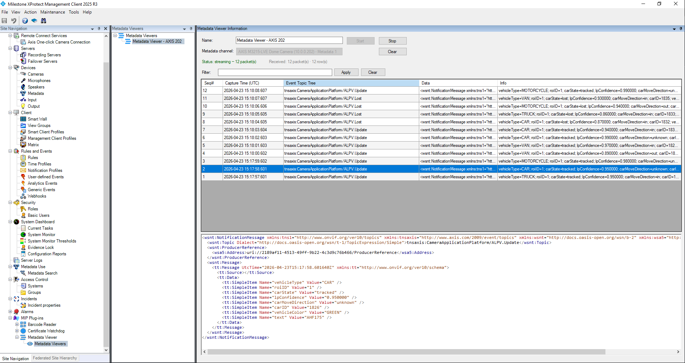

# Metadata Viewer

Subscribe to any metadata channel from within the Management Client and inspect the live ONVIF event stream. Each `NotificationMessage` is parsed into a table row, and clicking a row shows the full pretty-printed, syntax-highlighted XML in a preview pane below.

Useful for verifying analytics pipelines, debugging ONVIF event schemas during camera integration, and confirming that a camera is actually emitting the data you expect before wiring it into rules or alarms.

## Quick Start

1. Open the **Management Client**
2. Navigate to the **Metadata Viewer** node in the sidebar
3. Right-click and **Create New** to add a viewer
4. Give it a name, click the channel button, and pick a metadata channel
5. Save, then click **Start**
6. Newest packets appear on top. Click any row to see its XML formatted below
7. Click **Stop** when finished, or **Clear** to empty the table

## Columns

| Column | Description |
|---|---|
| **Seq#** | Per-viewer sequence number assigned on arrival |
| **Capture Time (UTC)** | From the ONVIF `tt:Message/@UtcTime`. A trailing `*` means the attribute was missing on the wire and the column shows the receive time instead |
| **Event Topic Tree** | The `wsnt:Topic` value, e.g. `tnsaxis:CameraApplicationPlatform/ALPV.Update` |
| **Data** | Compact XML of the `NotificationMessage`. Click the row to see the full payload highlighted in the preview pane |
| **Info** | `Name=Value` pairs extracted from `tt:SimpleItem` entries. Items found under `tt:Source` are shown in square brackets, e.g. `[channel=1]` |

## Filter

Type a substring into the filter bar and press **Apply** (or Enter). Matches are case-insensitive across `Topic`, `Data`, and `Info`. **Clear** empties the filter and restores all rows.

## Notes

- The table keeps the most recent 5000 rows; oldest are trimmed as new packets arrive.
- Payloads that are not ONVIF `NotificationMessage` events (or fail to parse) are still shown: a single row is emitted with the raw XML in the *Data* column so nothing is silently dropped.
- The viewer runs in the Management Client only; there is no Event Server component and no Rules integration. Stopping the Management Client ends the subscription.
- Diagnostic messages (subscribe details, heartbeats, status flags, errors) go to `%ProgramData%\Milestone\XProtect Management Client\Logs\MIPtrace.log`. Search the log for `MetadataViewer`.

## Troubleshooting

| Problem | Fix |
|---|---|
| **Start** button stays disabled after picking a channel | The selected item is not a valid metadata source. Pick a different channel. |
| Status shows `streaming (waiting for first packet...)` indefinitely | The camera isn't emitting metadata right now. Confirm the channel is enabled on the device and that analytics / events are actually running. |
| Capture Time shows `*` marker | The camera's metadata XML did not include `tt:Message/@UtcTime`; the plugin falls back to the receive time. Per ONVIF this attribute is mandatory, so the device is non-compliant. |
| No rows appear even under load | Check `MIPtrace.log` for `MetadataViewer` entries. Look for `LiveSource ErrorEvent` or a missing `Init() OK` line. |

